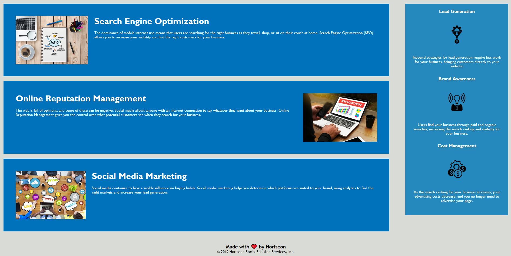

# UofT SCS Bootcamp Assignment 1: HTML, CSS, Git

## Introduction
Given code to refactor, improve accessbility, and replace unneccessary elements with semantic elements.
Several steps were taken to achieve the goal of an accessible, efficient webpage through meta data edits, repaired missing code, accessibility improvements, use of semantic code, condensation of CSS, and adding comments.
## Table of Contents
1. [Motivation](#motivation)
2. [Changelog](#changelog)
3. [Images](#images)
4. [Installation](#installation)
5. [Contribute](#contribute)
6. [Credits](#credits)
7. [License](#license) 
## Motivation
- To optimize the Horiseon webpage.
## Changelog
### Meta data edit: 
Changed title of data from "website" to "Horiseon Main Page"
### Repaired missing code: 
Added id search-engine-optimization to appropriate section in the content, allowing for the headers to navigate to their respective content, similar to the other items in the header.
### Accessibility improvements: 
Added alt text descriptions for all featured images.
### Semantic Code: 
Replaced numerous instances of div elements with respective elements, including header, footer, img, ul, and section elements, changing their respective CSS adjustments from classes to elements (if necessary).
### Condensation of CSS:
- Replaced benefit-lead, benefit-brand, and benefit-cost h3 elements with one h3 element selector in the benefits class, replacing the respective classes in the HTML file.
- Replaced benefit-lead, benefit-brand, and benefit-cost img elements with one img element selector in the benefits class, replacing the respective classes in the HTML file.
- Replaced benefit-lead, benefit-brand, and benefit-cost class selectors with one benefits class selector, replacing the respective classes in the HTML file.
- Replaced search-engine-optimization, online-reputation-management, and social-media-marketing class selectors with single box-content class replacing the respective classes in HTML file.

## Images
- Images of working website:

## Installation
- N/A
## Contribute
If you would like to contribute simply create a issue!
## Credits
Xandromus - https://github.com/Xandromus
## License
MIT License

Copyright (c) 2022 Horiseon

Permission is hereby granted, free of charge, to any person obtaining a copy
of this software and associated documentation files (the "Software"), to deal
in the Software without restriction, including without limitation the rights
to use, copy, modify, merge, publish, distribute, sublicense, and/or sell
copies of the Software, and to permit persons to whom the Software is
furnished to do so, subject to the following conditions:

The above copyright notice and this permission notice shall be included in all
copies or substantial portions of the Software.

THE SOFTWARE IS PROVIDED "AS IS", WITHOUT WARRANTY OF ANY KIND, EXPRESS OR
IMPLIED, INCLUDING BUT NOT LIMITED TO THE WARRANTIES OF MERCHANTABILITY,
FITNESS FOR A PARTICULAR PURPOSE AND NONINFRINGEMENT. IN NO EVENT SHALL THE
AUTHORS OR COPYRIGHT HOLDERS BE LIABLE FOR ANY CLAIM, DAMAGES OR OTHER
LIABILITY, WHETHER IN AN ACTION OF CONTRACT, TORT OR OTHERWISE, ARISING FROM,
OUT OF OR IN CONNECTION WITH THE SOFTWARE OR THE USE OR OTHER DEALINGS IN THE
SOFTWARE.